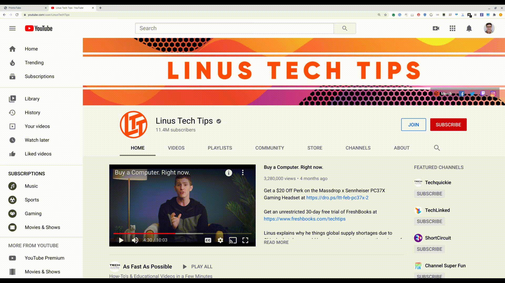
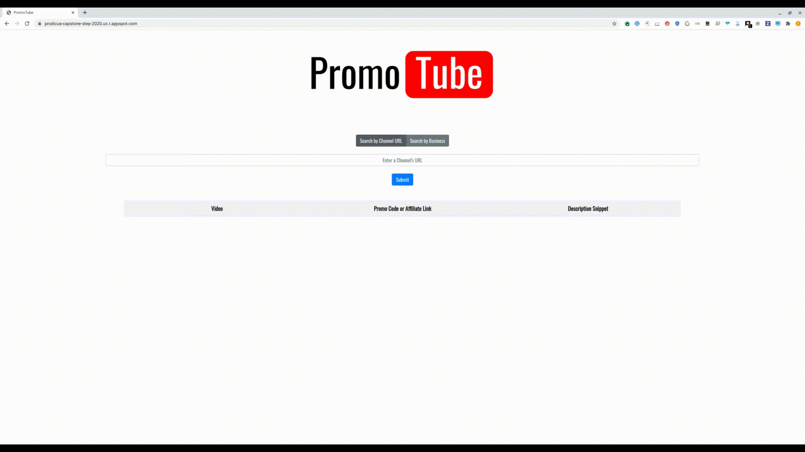

# PromoTube

PromoTube is a browser-based web application which extracts promotional codes and affiliate links from YouTube video descriptions. Check us out at [https://promo-tube.com](https://promo-tube.com)!

## Background

YouTube content creators receive external sponsorships from companies to advertise products to their subscribers. This often comes in the form of promo codes and affiliate links which are written in the description of their YouTube video. These provide discounts for their followers while also giving some proceeds back to the creator. Currently, there exists no way for viewers or consumers to easily aggregate these discount codes without manually searching through videos. By compiling the promotional codes from a specific content creator or company, users will be able to more easily support their favorite YouTubers while finding discounts for themselves.

## Demo

### Search by YouTube Channel


### Search by Company


## Getting Started

These instructions will get you a copy of the project up and running on your local machine for development and testing purposes. See deployment for notes on how to deploy the project on a live system.

### Prerequisites

This app requires Maven. To install Maven run

```
sudo apt install maven
```
This app requires at least JDK 8. To install JDK 8 or higher run
```
sudo apt install openjdk-8-jre-headless
```
or
```
sudo apt install default-jdk 
```
Note: These instructions are for Linux systems.

## Running Tests

### Unit Testing

To run unit tests run
```
mvn test
```

To run end to end tests run
```
mvn package appengine:run
```

## Deployment

Prior to deploying the app, add a YouTube Data API key to YouTubeInfoScraper.java.
To deploy the app on a server run

```
mvn package appengine:deploy
```
with the proper project ID in the pom.xml file.

To deploy locally run
```
mvn package appengine:run
```
This will deploy the webapp on local host port 8081 at http://localhost:8081

## Built With

* [BootStrap 4](https://getbootstrap.com/docs/4.0/getting-started/introduction/) - The CSS framework used
* [jQuery](https://api.jquery.com/) - Javascript Library
* [Maven](https://maven.apache.org/) - Dependency Management
* [YouTube Data API v3](https://developers.google.com/youtube/v3) - YouTube API

## Authors

* **Dante Allen** - [dallen68](https://github.com/dallen68)
* **Margaret Chan** - [margaretchan](https://github.com/margaretchan)
* **Josef Jankowski** - [josefj1519](https://github.com/josefj1519)

See also the list of [contributors](https://github.com/dallen68/PromoTube/contributors) who participated in this project.

## License

This project is licensed under the Apache 2 License - see the [LICENSE](LICENSE) file for details.

## Acknowledgments

* We would like to thank our hosts [Sam Li](https://github.com/LiRq95) and [Derrill Dabkoski](https://github.com/derrillhd) who guided us through this process.
